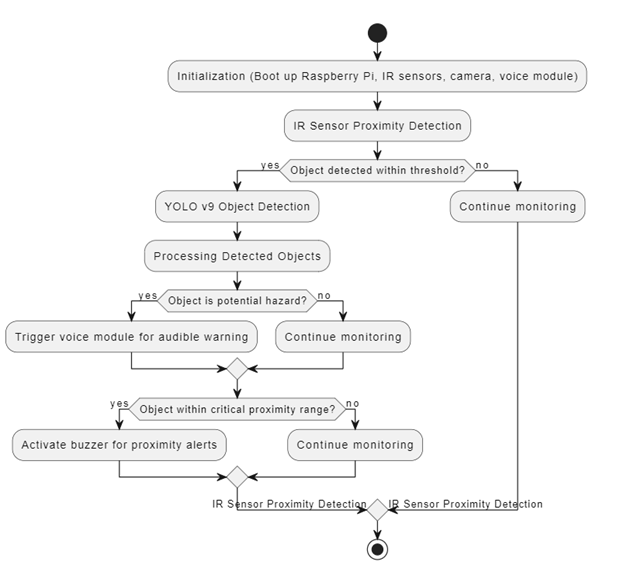
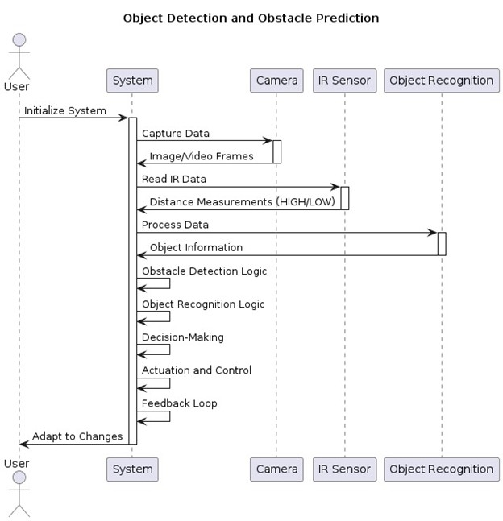

# Ishare — Smart Cane for the Visually Impaired

<p align="center">
  <b>An AI-powered smart cane prototype for real-time obstacle detection, object recognition, and user feedback</b>
</p>

<p align="center">
  
  
  
  
  
</p>

---

## Abstract
The "Ishare" project intends to create a working prototype of a smart cane to help blind people safely and freely navigate their environment. The smart cane uses YOLOv9 for object identification, IR sensors, a buzzer, and Raspberry Pi 4 (RPi 4) for obstacle detection to give the user real-time information about objects and obstacles in their path.

The main goals of the research are:
- To apply IR sensors for proximity detection in order to detect barriers.
- To use the YOLOv9 model for advanced object recognition.

The central processing unit is the RPi 4, which gathers data from sensors and processes it to provide the user with feedback signals. Essential components include:
- **IR sensors** for proximity detection.
- **Camera module** for recording live video feeds.
- **Speaker/Buzzer** for giving the user haptic and auditory feedback.

The system architecture is made up of interconnected modules that handle human interface, processing, and sensor data collection. The RPi's user-friendly interface allows customization of settings such as feedback preferences and sensitivity.

In practical use, the smart cane keeps an eye on the user's surroundings, identifying and categorizing obstacles through the processing of a live video stream by the YOLOv9 model. Haptic vibrations and audible alerts provide the user with real-time feedback, improving their awareness and safety while navigating.

This project has the potential to significantly enhance the mobility and independence of people with visual impairments by addressing the challenges they face in dynamic environments. Future improvements will include enhancing object identification capabilities, integrating GPS features, and optimizing battery life for extended use.

To sum up, the "Ishare" smart cane project is an innovative application of technology to promote inclusivity and accessibility for individuals with visual impairments. Through the use of IR sensors, advanced object recognition algorithms, and the RPi 4, this project seeks to make a meaningful difference in their lives.

---

## Key Features

### YOLOv9 Object Detection

The system uses **YOLOv9** to process the live camera feed and identify objects in the user's surroundings.

This allows the system to move beyond simple proximity detection by providing information about the type of detected object.

### IR Proximity Detection

IR sensors provide an additional layer of obstacle detection by identifying objects within a predefined proximity range.

This complements camera-based object recognition and provides a direct proximity-sensing mechanism.

### Auditory Feedback

The system can provide audible alerts through a **buzzer / voice module**, allowing users to receive information without relying on visual interfaces.

### Haptic Feedback

Haptic/vibration feedback provides another channel for communicating detected obstacles to the user.

Using multiple feedback mechanisms makes the system less dependent on a single form of notification.

### Customizable Settings

The Raspberry Pi-based interface allows configuration of parameters such as:

* Feedback preferences
* Detection sensitivity
* Proximity thresholds

### Real-Time Monitoring

The system continuously processes information from the camera and proximity sensors to monitor the user's surrounding environment.

---

# System Architecture

The Ishare system consists of four major layers:

```text
┌───────────────────────────────────────────┐
│              INPUT LAYER                  │
│                                           │
│      Camera Module      IR Sensors        │
└───────────────┬───────────────┬───────────┘
                │               │
                ▼               ▼
┌───────────────────────────────────────────┐
│             PROCESSING LAYER              │
│                                           │
│              Raspberry Pi 4               │
│                                           │
│       ┌──────────────────────────┐        │
│       │       YOLOv9 Model       │        │
│       │   Object Detection       │        │
│       └──────────────────────────┘        │
└────────────────────┬──────────────────────┘
                     │
                     ▼
┌───────────────────────────────────────────┐
│             DECISION LAYER                │
│                                           │
│   Object Recognition + Proximity Status   │
│          + Hazard Assessment              │
└────────────────────┬──────────────────────┘
                     │
                     ▼
┌───────────────────────────────────────────┐
│             FEEDBACK LAYER                │
│                                           │
│          Auditory        Haptic           │
│          Feedback        Feedback         │
└────────────────────┬──────────────────────┘
                     │
                     ▼
                  USER
```

---

## Operational Workflow

The system follows a continuous monitoring and feedback process.

### Step 1 — System Initialization

The Raspberry Pi initializes the connected components, including:

* Camera
* IR sensors
* Feedback modules
* Object detection system

### Step 2 — Proximity Detection

The IR sensors monitor the environment for nearby obstacles.

If an object is detected within the configured proximity threshold, the system can initiate the corresponding feedback mechanism.

### Step 3 — Visual Detection

The camera captures the surrounding environment as a live video stream.

The video frames are processed using the YOLOv9 object detection model.

### Step 4 — Object Recognition

YOLOv9 identifies and categorizes objects detected within the camera's field of view.

### Step 5 — Hazard Assessment

Information from the object recognition system and proximity sensors is used to determine whether feedback should be provided to the user.

### Step 6 — User Feedback

The system communicates relevant information through:

* Auditory alerts
* Buzzer/voice feedback
* Haptic/vibration feedback

This process runs continuously while the smart cane is operating.

---

# System Diagrams

## Flowchart

The project includes a system flowchart describing the overall operational process.



The flowchart represents:

```text
System Initialization
        │
        ▼
IR Proximity Detection
        │
        ▼
Object Detection
     (YOLOv9)
        │
        ▼
Hazard / Proximity Assessment
        │
        ▼
Feedback Generation
        │
        ▼
User Awareness
```

---

## Sequence Diagram

The project also includes a sequence diagram showing communication between the major components.



The sequence represents interactions between:

* Camera
* IR Sensor
* Object Recognition Module
* User

The components work together to capture environmental information, process it, identify potential obstacles, and communicate feedback to the user.

---

# Hardware Components

| Component                      | Purpose                                           |
| ------------------------------ | ------------------------------------------------- |
| **Raspberry Pi 4**             | Central processing and control unit               |
| **Camera Module**              | Captures the live visual environment              |
| **IR Sensors**                 | Detect nearby obstacles using proximity detection |
| **YOLOv9**                     | Performs object detection and recognition         |
| **Buzzer**                     | Provides auditory alerts                          |
| **Voice Module**               | Provides audio-based feedback                     |
| **Haptic/Vibration Mechanism** | Provides tactile feedback                         |

---


## Components Used
- **Raspberry Pi 4**: Central processing unit for data collection and processing.
- **YOLOv9**: Advanced object detection model.
- **IR Sensors**: For proximity detection.
- **Camera Module**: Captures live video feed for object recognition.
- **Buzzer and Voice Module**: Provides auditory and haptic feedback.

---

# AI Component — YOLOv9

YOLOv9 is used as the computer vision component of the smart cane.

Instead of relying only on proximity sensors, the camera-based detection system allows the cane to identify and categorize objects within the camera's view.

The general processing pipeline is:

```text
Live Camera Feed
       │
       ▼
Image / Video Frame
       │
       ▼
YOLOv9 Inference
       │
       ▼
Detected Objects
       │
       ▼
Object / Hazard Information
       │
       ▼
Feedback System
```

This gives Ishare two complementary sensing mechanisms:

**Camera + YOLOv9**

for visual object recognition, and

**IR Sensors**

for proximity-based obstacle detection.

---

# Sensor + Vision Integration

One of the key aspects of the project is the combination of **vision-based detection and proximity sensing**.

The two systems provide different types of environmental information:

| System          | Primary Function                             |
| --------------- | -------------------------------------------- |
| Camera + YOLOv9 | Identify and categorize objects              |
| IR Sensors      | Detect nearby obstacles                      |
| Raspberry Pi 4  | Process and coordinate system information    |
| Feedback System | Communicate relevant information to the user |

Combining these components allows Ishare to approach obstacle awareness from both a **visual recognition** and **proximity detection** perspective.

---

# Repository Structure

The repository contains the YOLOv9 implementation together with supporting modules and project documentation.

```text
Ishare/
│
├── classify/
├── data/
├── figure/
├── models/
├── panoptic/
├── scripts/
├── segment/
├── tools/
├── utils/
│
├── detect.py
│
├── Picture1.png
├── Picture2.jpg
│
└── README.md
```

### Important Files / Directories

| File / Directory | Purpose                                 |
| ---------------- | --------------------------------------- |
| `detect.py`      | Detection-related execution script      |
| `models/`        | Model-related components                |
| `data/`          | Dataset/configuration-related resources |
| `utils/`         | Supporting utilities                    |
| `scripts/`       | Supporting scripts                      |
| `classify/`      | Classification-related components       |
| `segment/`       | Segmentation-related components         |
| `panoptic/`      | Panoptic-related components             |
| `Picture1.png`   | System flowchart                        |
| `Picture2.jpg`   | System sequence diagram                 |

---

# How to Use

## 1. Hardware Setup

Connect the required components to the Raspberry Pi:

* IR sensors
* Camera module
* Buzzer
* Voice module
* Haptic/vibration mechanism

Ensure that the components are correctly powered and configured.

---

## 2. Software Setup

Set up the Raspberry Pi environment with the required Python libraries and YOLOv9 implementation.

Clone the repository:

```bash
git clone https://github.com/sayan1511/Ishare.git
cd Ishare
```

Install the required dependencies according to the YOLOv9 implementation and Raspberry Pi environment.

---

## 3. Configure the System

Configure:

* IR proximity thresholds
* Feedback preferences
* Detection-related settings
* Camera configuration

The project is designed to allow feedback and sensitivity settings to be customized according to the intended use.

---

## 4. Start the System

Power on the Raspberry Pi and initialize the smart cane.

The system then:

```text
Initialize Hardware
       ↓
Start Camera
       ↓
Monitor IR Sensors
       ↓
Process Camera Feed
       ↓
Run YOLOv9 Detection
       ↓
Assess Obstacles
       ↓
Generate Feedback
       ↓
Continue Monitoring
```

---

# Project Demonstration

A demonstration video of the project is available on YouTube:

**[▶️ Watch the Ishare Project Demo](https://youtu.be/FP8hflIMdJw)**

The demonstration shows the working concept and interaction of the smart cane components.

---


## Future Enhancements
- Integration of GPS for navigation assistance.
- Improved object detection capabilities with optimized YOLOv9.
- Extended battery life for prolonged usage.
- Enhanced haptic feedback mechanisms.


--- 

# Project Evaluation

The current repository focuses primarily on demonstrating the integrated smart-cane prototype.

The project combines:

* Real-time object detection
* Proximity sensing
* Embedded processing
* Audio feedback
* Haptic feedback

Rather than presenting unsupported numerical performance claims, future iterations can include more systematic measurements such as:

* Object detection accuracy
* Precision and recall
* mAP
* Inference latency
* Real-time FPS
* Sensor detection range
* Battery operating time
* False-positive / false-negative rates

These metrics would provide a more comprehensive evaluation of the system under different environmental conditions.

---

## Project Status

**Status:** Prototype / Academic Project

The project is open for further development, optimization, testing, and hardware integration.

---

<p align="center">
  <b> Building technology for safer and more independent mobility.</b>
</p>
